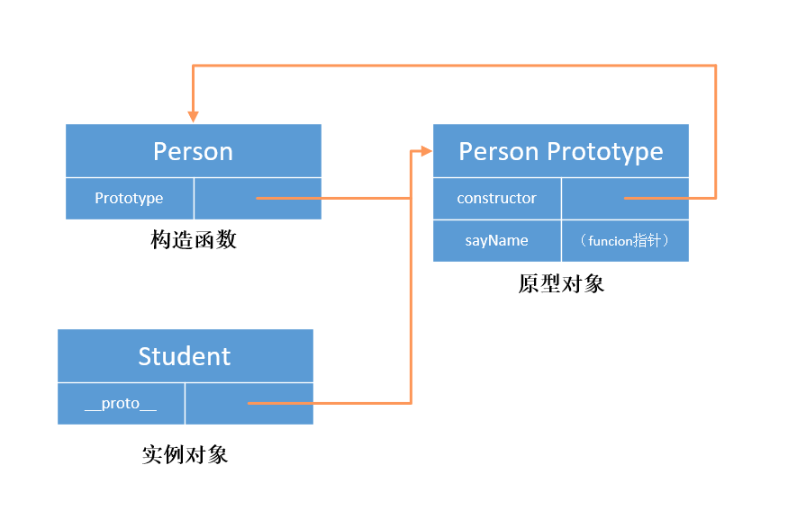

# class

定义一个类

**类声明**

通过`class`关键字, 我们可以声明一个类, 类的首字母大写, 类不会存在变量提升

**类表达式**

类表达式是可以匿名的, 也可以命名， 类表达式也不存在变量提升

## constructor

一个类里面只有一个, 用于创建和初始化一个对象, 也就是 class 的实例。

## super

1. 作为对象, 在普通函数中,代表父类的原型对象 `super.someFn()`, 通过`super`调用父类的方法时, super 会绑定子类的 this 值`, 在静态方法中,指向父类.
2. `constructor`中调用`super()`来获取 this 值, 子类本身没有自己的 this， `super`方法执行后生成子类自己的 this

## static

定义一个类的一个静态方法.

静态方法不能通过实例调用. 通过类直接调用

静态方法中的 this, 表示 **当前类**, 而不是实例

## extends

创建一个类作为另一个类的子类， 如果子类中有构造函数`constructor`, 则需要在使用`this`之前首先调用`super`来获取 this 值

## 注意

类内部定义的方法是不可枚举的

子类的`__proto__`属性 总是指向父类 表示构造函数的继承

子类的`prototype.__proto__`指向父类的`prototype` 表示方法的继承

### 原型

我们创建的每一个函数都有一个 prototype 属性，这个属性是一个指针，指向一个对象。这个对象的用途是包含可以由特定类型的所有实例共享的属性和方法，简单来说，该函数实例化的所有对象的**proto**的属性指向这个对象，它是该函数所有实例化对象的原型。



### 原型链

每个对象拥有一个**原型对象**，对象以其原型为模板、从原型继承方法和属性。原型对象也可能拥有原型，并从中继承方法和属性，一层一层、以此类推。这种关系常被称为**原型链 (prototype chain)**

原型链的主要实现方法是让构造函数的 prototype 对象等于另一个类型的实例，此时的 prototype 对象因为是实例，因此将包含一个指向另一个原型的指针，相应地另一个原型中也包含着一个指向另一个构造函数的指针


`constructor` 指向了用于构造此实例对象的构造函数.

`prototype` 类上的，该对象的原型对象

`__proto__` 实例上的,指向该对象的`prototype`

`prototype.__proto__` 上一层的原型对象, 顶层为 null，null 没有原型, 作为原型链的终点.

```javascript
function Persen() {}

Person.prototype = {}; // 原型

// student 继承
function Student() {}
Student.prototype = new Person(); // 原型链
Student.constructor = Student;
```

### new 做了什么？

1. 生成了一个对象
2. 链接到原型
3. 绑定了 this
4. 返回了新对象

实现一个 new

```javascript
function myNew() {
  let obj = {};
  let [constructor, ...args] = [...arguments];
  obj.__proto__ = constructor.prototype;

  let result = constructor.apply(obj, args);

  if ((result && typeof result === "function") || typeof result === "object") {
    return result;
  }
  return obj;
}
```

### 经典继承

在子类型构造函数的内部调用超类型构造函数

```javascript
function Father() {
  this.colors = ["red", "blue", "green"];
}
function Son() {
  Father.call(this); //继承了Father, 且向父类型传递参数
}

var instance = new Son();
instance.colors.push("black");
```

### 组合继承

将原型链和经典继承的技术结合到一起， 发挥两者之长的一种模式

```javascript
function Father() {}

Father.prototype.sayName = function () {};

function Son() {
  Father.call(this);
}
Son.prototype = new Father();

Son.prototype.sayAge = function () {};
```

❌ 缺点:

1. 会调用两次原型

### 原型继承

```javascript
function object(o) {
  let func = Function();
  func.prototype = o;
  return new func();
}
```

### 寄生式继承

寄生式继承的思路与(寄生)构造函数和工厂模式类似, 即创建一个仅用于封装继承过程的函数,该函数在内部以某种方式来增强对象,最后再像真的是它做了所有工作一样返回对象.

```javascript
function createAnthor(origin) {
  let clone = object(origin);
  clone.sayHi = function () {};
  return clone;
}
```

### 寄生组合式继承

降低调用父类构造函数的开销， 不必为了指定子类型的原型而调用超类型的构造函数

```javascript
function extend(subClass, superClass) {
  let prototype = object(superClass.prototype);
  prototype.constructor = subClass;
  subClass.prototype = prototype;
}
```
