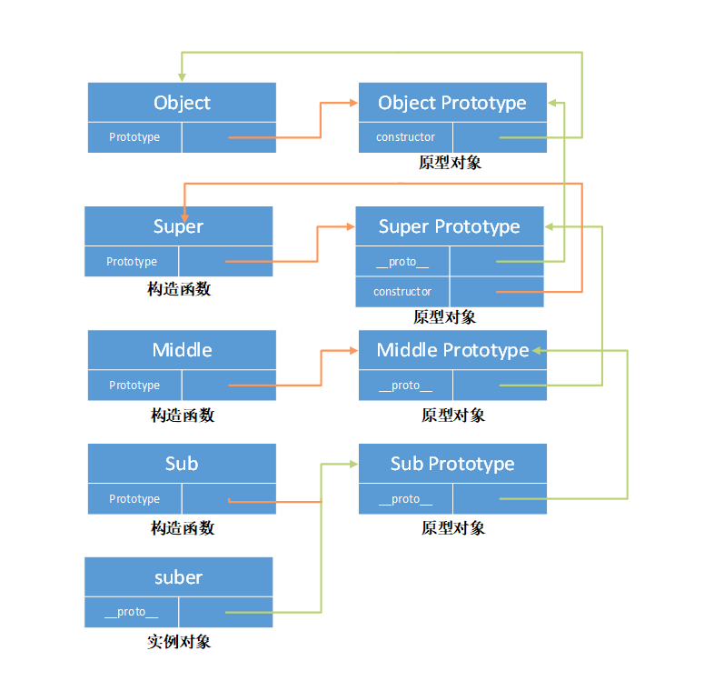

# 函数

js的**一等公民**

一等公民身份的由来:

1. 可以像普通函数一样 声明，调用
2. 作为参数被传递 `function func(x,callback){callback();}`
3. 作为返回值 `callback`
4. 可以赋值 `var func = function(){}`
6. 可以作为类的构造函数

说一下函数的几个注意点: **闭包** **作用域链** **原型链** **尾调用** **函数式编程** **递归**

## 函数式编程

函数式编程其实只是数学编程, 只是碰巧可以写程序.

## 特征

  1. 要求函数必须使纯的，不能有副作用.
  2. 函数是第一公民

函数的调用是存储在栈空间中的

> 栈空间主要是用来管理 JavaScript 函数调用的，栈是内存中连续的一块空间，同时栈结构是“先进后出”的策略。在函数调用过程中，涉及到上下文相关的内容都会存放在栈上，比如原生类型、引用到的对象的地址、函数的执行状态、this 值等都会存在在栈上。当一个函数执行结束，那么该函数的执行上下文便会被销毁掉。

### 添加默认值

下面给函数参数`n,y`添加默认值1和2

```
function defaultValue(n=1, y=2){

}

```

注意

1. 在函数内部不能再次用let和const声明函数的参数
2. 指明函数参数的默认值之后, length属性失效, 不会统计有默认值的参数 `(function (a, b, c = 5) {}).length // 2`


### rest参数

格式`...变量名` 用于获取函数的多余参数, 注意rest之后不能有其他参数

### 箭头函数

格式`() => {}`

特征:

1. 绑定声明时的父作用域this值
2. 如果只有一个参数不用带括号
3. 如果只有一个表达式返回, 不用写return和大括号

```
let x = a => a++;

```

在其他函数中可以使用`call apply bind`来修改this的指向

### 闭包

函数的返回值一个函数，在返回的函数中可以调用父级函数中的私有变量, 称为闭包

> 在一个函数与一组“私有”变量之间创建关联关系。在给定函数被多次调用的过程中，这些私有变量能够保持其持久性。变量的作用域仅限于包含它们的函数，因此无法从其它程序代码部分进行访问。不过，变量的生存期是可以很长，在一次函数调用期间所创建所生成的值在下次函数调用时仍然存在

### 递归

函数调用自身，称为递归

在函数调用时会生成调用记录, 递归的话, 会造成内存消耗严重， 优化的策略就是使用**尾递归**, 也就是在尾部调用自身, 只存在一个调用记录，不会发生内存溢出.

###  尾调用

指某个函数的最后一步是调用另一个函数

#### 尾递归优化

函数调用会在内存形成一个调用记录,保存调用位置和内部变量等信息。如果在函数A的内部调用函数B，那么在A的调用记录上方，还会形成一个B的调用记录。等到B运行结束，将结果返回到A，B的调用记录才会消失。如果函数B内部还调用函数C，那就还有一个C的调用记录栈，以此类推，形成调用栈。

尾调用由于是函数的最后一步操作，所以不需要保留外层函数的调用记录，因为调用位置、内部变量等信息都不会再用到了，只要直接用内层函数的调用记录，取代外层函数的调用记录就可以了。

尾调用优化的意义: 只保留内层函数的调用记录。如果所有函数都是尾调用，那么完全可以做到每次执行时，调用记录只有一项，将大大节省内存.

### 合成

如果一个值转变成另一个值的过程, 需要经过多个函数, 那么把多个函数合并成一个函数, 就是 `函数的合成`

```
function ride(num) {
  return num*num;
}

function add(num){
  return num + 1;
}


// 合成

const compose = function(ride, add){
  return function(x){
    return ride(add(x))
  }
}

compose(ride, add)(3) // 16

```

### 柯里化

将多个参数的函数修改为单个参数的函数

```
function add(x, y){
  return x + y;
}

// 柯里化之后

function add (x) {
  return function (y){
    return x + y;
  }
}

```

### 代数效应

用于将副作用从函数中调离

### throttle 节流

高频事件触发，但在n秒内只会执行一次，所以节流会稀释函数的执行频率

``` javascript
function throttle(fn, time){
  let canRun = true;
  return function (){
    if(!canRun) return;
    camRun = false;
    setTimeout(() => {
      fn.apply(this, arguments);
      canRun = true
    }, time)
  }
}
```

### debounce 防抖

一定在事件触发 n 秒后才执行，如果你在一个事件触发的 n 秒内又触发了这个事件，那我就以新的事件的时间为准，n 秒后才执行

``` javascript
function debounce(fn, wait){
  let timeout = null;
  return function() {
    if(timeout) {
      clearTimeout(timeout)
      timeout = null
    }
    timeout = setTimeout(() => {
      fn.apply(this, arguments)
    }, wait)
  }
}
```

作用域

1. 静态作用域
2. 动态作用域 （this是用来弥补JavaScript没有动态作用域特性）

```javascript
var type = 'global'
function bar() {
	var type = 'function'
	function foo() {
		console.log(type)
	}
  function foo2() {
    console.log(this.type)
  }
	foo()
  foo2()
}
bar()
// function global undefined
```

作用域链， 函数作用域 -> 全局作用域

**作用域**:  变量定义的区域， 它有一套访问变量的规则，这套规则来管理浏览器引擎如何在当前作用域以及嵌套的作用域中根据变量（标识符）进行变量查找

**作用域链：** 作用域链的作用是保证对执行环境有权访问的所有变量和函数的有序访问，通过作用域链，我们可以访问到外层环境的变量和 函数。

### 原型

我们创建的每一个函数都有一个 prototype 属性，这个属性是一个指针，指向一个对象。这个对象的用途是包含可以由特定类型的所有实例共享的属性和方法，简单来说，该函数实例化的所有对象的__proto__的属性指向这个对象，它是该函数所有实例化对象的原型。


### 原型链

每个对象拥有一个**原型对象**，对象以其原型为模板、从原型继承方法和属性。原型对象也可能拥有原型，并从中继承方法和属性，一层一层、以此类推。这种关系常被称为**原型链 (prototype chain)**

原型链的主要实现方法是让构造函数的 prototype 对象等于另一个类型的实例，此时的 prototype 对象因为是实例，因此将包含一个指向另一个原型的指针，相应地另一个原型中也包含着一个指向另一个构造函数的指针



`constructor` 指向了用于构造此实例对象的构造函数.

`prototype `  类上的，该对象的原型对象

`__proto__`  实例上的,指向该对象的`prototype`

`prototype.__proto__`  上一层的原型对象, 顶层为null，null没有原型, 作为原型链的终点.

``` javascript
function Persen() {}

Person.prototype = {} // 原型

// student 继承
function Student() {}
Student.prototype = new Person() // 原型链
Student.constructor = Student;
```


