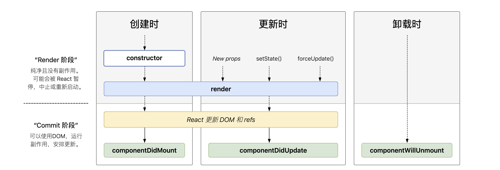

# react

记录下学习react的路程

**JSX**

javascript和xml结合的一种表达。 解析到`<>`当做HTML解析,`{}`当做js解析 个人理解`{}` 里面就是js语句

属性： 

   	1. 使用引号来定义字符串为值的属性
   	2. 使用大括号来定义js表达式为值的属性
          	1. `{2+2}`
          	2. `{user.name}`
          	3. `{format(date)}`
          	4. `{<Child />}`

标签:  闭合式标签, 可以相互嵌套

防注入攻击:  jsx会在渲染之前把内容都转成字符串, 有效的防止XSS攻击

关于babel转译: 将JSX转换成一个`React.createElement(type, props, children)`的方法调用

```react
const element = <h1 className="x">hello react</h1>
// 等同于
const element = React.createElement(
	'h1',
  {className: "x"},
  'hello react'
);
// 编译后其实是
let element = {
  type: "h1",
  props: {
    className: "x",
    children: "hello react"
  }
}
```


**元素**

元素是构成React应用的最小单位

元素是构成组件的一个部分.

元素是`immutable`不可变的

渲染元素`ReactDOM.render()` 

**组件**

接收任意的输入值, 并返回一个需要在页面上展示的React元素

组件名称必须以大写字母开头

不可以修改其props, 但是在子组件中可以调用props传递的方法, 修改父级的数据

定义一个组件

1. 通过函数定义

```react
function Welcome(props){
  return <h1>hello, {props.name}</h1>
}
```

2. 通过es6 `class`定义

```react
class Welcome extends React.Component{
  render(){
    return <h1>Hello, {this.props.name}</h1>
  }
}
```

受控组件和非受控组件

渲染

当React遇到的元素是用户自定义的组件, 会将JSX属性作为单个对象传递给该组件, 这个对象称之为`props`, 通过`React.render`来渲染, `render`方法返回null会阻止渲染.

```react
const element = <Welcome name="lnb"/>
React.render(
	element,
	document.getElementById('root')
)
```

**state 和 lifecycle**



挂载

当组件实例被创建并插入DOM中时, 生命周期调用顺序如下:

**constructor()** => **render()** => **componentDidMount()**

**constructor** 只用来初始化state和绑定实例

更新

当组件的`props`或者`state`发生变化时触发更新.

**shouldComponentUpdate()** => **render()** => **componentDidUpdate()**

如果**shouldComponentUpdate**返回**false**, **render**不会调用

卸载

当组件从DOM中移除时会调用如下方法

**componentWillUnmount()**

****

通过`setState()`来更新组件局部状态,可以传入对象和函数,函数时,将接收之前的状态为第一个参数, 将此次更新被应用的`props`作为第二参数

注意：

1. 不要直接更新状态, 也就是说通过`setState`来,构造函数是唯一能初始化`this.state`的地方
2. 状态更新可能是异步的, 

### 事件处理

1. 属性名采用驼峰写法
2. 需要传入一个函数作为事件处理函数,而不是一个字符串
3. 不能通过`return false`来阻止默认行为, 必须通过`e.preventDefault()`
4. 注意this值的绑定

```react
let ele = (
	<div onClick={do}></div>
)
```

### 条件渲染

1. 在`render`使用`if`来做
2. 使用`&&`
3. 使用三元运算符

```react
function loginControl(){
  return ( 
  	<div>
      <h1>Hello!</h1>
      {unreadMessages.length > 0 &&
        <h2>
          You have {unreadMessages.length} unread messages.
        </h2>
      }
			 <div>
      {isLoggedIn ? (
        <LogoutButton onClick={this.handleLogoutClick} />
      ) : (
        <LoginButton onClick={this.handleLoginClick} />
      )}
	    </div>
	  </div>
    )
}
```

### 列表

1. 通过`map`方法来生成列表元素
2. 元素位于`map`方法内时需要设置键(key)属性
3. key只是在兄弟节点唯一

### Hooks

### useState

useState 返回了一个state，以及更新state的函数

```react
const [state, setState] = useState(initialState);
```

`initialState`  只在组件初始渲染时起作用

1. 不需要特殊计算， 直接写值。比如`useState(3)`
2. 需要特殊计算, `initialState`是一个函数, 在函数内计算并返回初始的state

`setState`的传值

1. 不需要依赖之前的state, 直接传值，将state修改。
2. 需要依赖之前的state, 传一个函数, 函数的参数是之前的state, 并返回一个更新后的值

**注意** `useState`不可以在条件语句中使用

```react
import React, {useState} from 'react'
function Welcome () {
	// useState的使用
	const [name, setName] = useState('lnb')
	return (
    <div>
      <h2>Welcome {name}</h2>
      <input onChange={(e) => setCount(e.target.value)}></input>
    </div>
	)
}
```

### useEffect(didUpdate)

使用 `useEffect` 完成副作用（订阅,  设置定时器）操作.  赋值给`useEffect`的函数会在组件渲染到屏幕之后执行。 如果执行了有副作用操作, 需要返回一个函数来清除effect.

在每次state修改时会再次调用。

第二个参数可以控制effect的调用。

```react
// count修改时调用
useEffect(() => {
  
}, [count])

// 只调用一次
useEffect(() => {
  
}, [])
```

`useEffect` 通过返回一个函数来清除影响

### useContext

```react
const value = useContext(MyContext)
```

接收一个context对象(React.createContext的返回值) 并返回该context的当前值。 当前的context值由上层组件中距离当前组件最近的`<MyContext.Provider>`的`value`prop决定

当巨剑上层最近的`<MyContent.Provider>`更新时, 该Hook会触发重新渲染, 并使用最新传递给`MyContext`provider的context `value`值

### useReducer

```react
const [state, dispatch] = useReducer(reducer, initialArg, init);
```

接收一个形如`(state, action) => newState`的reducer， 并返回当前state以及与其配套的dispatch方法.

```react
const initialState = {count: 0}
function reducer (state, action) {
  switch(action.type){
    case 'increment':
      	return {count: state.count + 1}
    case 'decrement':
      	return {count: state.count - 1}
    default: 
      	throw new Error()
  }
}

function Counter(){
  const [state, dispatch] = useReducer(reducer, initialState);
  return (
  	<div>
    	Count: {state.count}
			<button onCLick={() => dispatch({type: 'increment'})}> + </button>
      <button onClick={() => dispatch({type: 'decrement'})}>-</button>
    </div>
  )
}
```

### useRef

```react
const refContainer = useRef(initialValue);
```

`useRef` 返回一个可变的ref对象。 其`.current`属性被初始化为传入的参数(initialValue)。 返回的ref对象在组件的整个生命周期内保持不变。


### useCallback

不懂

### useMemo

不懂

TODO

useContext的例子

### Diff

对比两颗树， 比较两棵树的根节点。

1. 对比不同类型的树, 拆卸原有的树并且建立起新的树
2. 对比同类型的树，React 会保留 DOM 节点，仅比对及更新有改变的属性
   1. 对子节点进行递归,同时遍历两个两个子元素的列表, 当产生差异时, 生成一个`mutation`
   2. `key ` 当子元素拥有 key 时，React 使用 key 来匹配原有树上的子元素以及最新树上的子元素

### Refs

集成第三方DOM， 强制出发动画， 管理文本选择, 媒体播放

`React.createRef()`创建, 通过`ref`属性附加到React元素上

```react
class MyComponent extends React.Component {
  constructor(props) {
    super(props);
    this.myRef = React.createRef();
  }
  render() {
    return <div ref={this.myRef} />;
  }
}
```

访问:  通过`current`属性可以访问到`ref`绑定的元素

`ref`值会根据节点的类型而有所不同

1. 类型为`HTML`时, 构造函数中使用 `React.createRef()` 创建的 `ref` 接收底层 DOM 元素作为其 `current` 属性
2. 类型为`class`组件元素时, `ref` 对象接收组件的挂载实例作为其 `current` 属性。
3. 不能在函数组件上使用`ref`属性，因为他们没有实例
4. 可以在函数组件内部使用`ref`属性, 只要它指向一个 DOM 元素或 class 组件

ref转发

`Ref`转发是一个可选特性, 其允许某些组件接收ref,并将其向下继续传递. 也就是转发给子组件

通过`React.forwardRef((props, ref) => {})`来创建一个Ref转发

```react
const FancyButton = React.forwardRef((props, ref) => {
  <button ref={ref} className="FancyButton">
    {props.children}
  </button>
})

const ref = React.createRef();
<FancyButton ref={ref}>Click me!</FancyButton>
```

注意⚠️: props 中不存在 `ref`

### React.Fragment

Fragment允许我们一个组件返回多个元素

```react
render() {
  return (
    <React.Fragment>
      <ChildA />
      <ChildB />
      <ChildC />
    </React.Fragment>
  );
}

or

render() {
  return (
    <>
      <ChildA />
      <ChildB />
      <ChildC />
    </>
  );
}
```

### Portals

提供了一种将子节点渲染到存在于父组件以外的 DOM 节点的优秀的方案

`React.createPortal(child, domNode)`


### Context

共享那些对于一个组件树而言是“全局”的数据

 `const MyContext = React.createContext(defaultValue)`

创建一个 Context 对象。

当 React 渲染一个订阅了这个 Context 对象的组件，这个组件会从组件树中离自身最近的那个匹配的 `Provider` 中读取到当前的 context 值。

只有当组件所处的树中没有匹配到 Provider 时，其 `defaultValue` 参数**才**会生效

`<MyContext.Provider value={}/>`

每个 Context 对象都会返回一个 Provider React 组件，它允许消费组件订阅 context 的变化。

Provider 接收一个 `value` 属性，`value`值发生变化, 内部的消费组件都会重新渲染

```react
// Context 可以让我们无须明确地传遍每一个组件，就能将值深入传递进组件树。
// 为当前的 theme 创建一个 context（“light”为默认值）。
const ThemeContext = React.createContext('light');

class App extends React.Component {
  render() {
    // 使用一个 Provider 来将当前的 theme 传递给以下的组件树。
    // 无论多深，任何组件都能读取这个值。
    // 在这个例子中，我们将 “dark” 作为当前的值传递下去。
    return (
      <ThemeContext.Provider value="dark">
        <Toolbar />
      </ThemeContext.Provider>
    );
  }
}

// 中间的组件再也不必指明往下传递 theme 了。
function Toolbar(props) {
  return (
    <div>
      <ThemedButton />
    </div>
  );
}

class ThemedButton extends React.Component {
  // 指定 contextType 读取当前的 theme context。
  // React 会往上找到最近的 theme Provider，然后使用它的值。
  // 在这个例子中，当前的 theme 值为 “dark”。
  static contextType = ThemeContext;
  render() {
    return <Button theme={this.context} />;
  }
}
```


## Props

类型检查

### PropTypes


