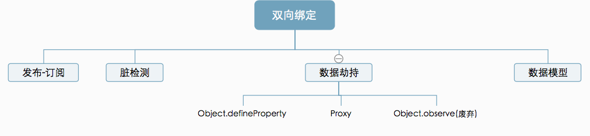

## Vue

### 面试

1. React / Vue.js 之类的框架为什么需要给组件添加 key 属性，其作用是什么？


### 双向数据绑定

借用网上一张图来说一下双向数据绑定



可以发现`Object.defineProperty和Proxy`都处于数据劫持

数据劫持的优势:

1. 无需显示调用
2. 可精确得知变化数据

### mixin

混入 (mixin) 提供了一种非常灵活的方式，来分发 Vue 组件中的可复用功能。一个混入对象可以包含任意组件选项。当组件使用混入对象时，所有混入对象的选项将被“混合”进入该组件本身的选项。

可重用性高。 

那如果是`import`一个对象进来和`mixin`有啥区别呢? 

`import`进来的

**全局混入**:  对每个组件都生效

```
Vue.mixin({
  create(){}
})
```

**组件混入** : 只对当前组件生效

```vue
import mixins from 'util/mixin.js'
export default {
  mixins: [mixins]
}
```

注意:

当组件和混入对象含有同名选项时，

1. 数据对象在内部会进行递归合并，并在发生冲突时以组件数据优先
2. 同名钩子函数将合并为一个数组，因此都将被调用。另外，混入对象的钩子将在组件自身钩子**之前**调用
3. 值为对象的选项，例如 `methods`、`components` 和 `directives`，将被合并为同一个对象。两个对象键名冲突时，取组件对象的键值对

### 自定义指令(directive)

需要对普通 DOM 元素进行底层操作，这时候就会用到自定义指令

一个指令定义对象可以提供如下几个钩子函数 (均为可选)：

`bind` 只调用一次，指令第一次绑定到元素时调用

`inserted` 被绑定元素插入父节点时调用

`update` 所在组件的 VNode 更新时调用

`componentUpdated` 指令所在组件的 VNode 及其子 VNode 全部更新后调用

`unbind` 只调用一次，指令与元素解绑时调用

顺序传递以下参数

`el` 指令所绑定的元素，可以用来直接操作DOM

`binding` {name(指令名,不包含v-), value(指令的绑定值), oldValue(指令绑定的前一个值), arg(传参 v-show:yes eg: yes)， modifiers(修饰符 v-show.hide eg: hide)}

`vnode`  Vue编译生成的虚拟节点

`oldVnode` 上一个虚拟节点

**全局指令**

```vue
Vue.directive('track', {
  bind(el, binding){
    console.log('开始监听')
  }
})
```

**组件指令**

```vue
import track from './directives'
new Vue({
  directives: {
    track
  }
})
```


### 过滤器filter

用于一些常见的文本格式化。 过滤器可以用在两个地方：双花括号插值和`v-bind`表达式. 

```
{message | filterA}
```

**全局过滤器** 

```
Vue.filter('format', function(value) {
  return dayjs(value).format('YYYY-MM-DD')
})
```

**局部过滤器**

```
filters: {
  format(value){
    return dayjs(value).format('YYYY-MM-DD')
  }
}

```

### 组件

抽离出部分公共组件

**全局注册**

```
Vue.component('Button', {
  data,
  template,
  props,

})
```

### 生命周期


创建

beforeCreate

created

挂载

beforeMount

mounted

更新

beforeUpdate

updated

keep-alive的状态

activated

deactivated

卸载

beforeDestroy

destroyed

### computed

计算属性. 计算属性的结果会被缓存. 只有计算属性依赖的data修改时才会更新缓存.

### 高阶组件

`transition`和`keep-alive`

`keep-alive` 涉及到的`LRU`算法

max 设置最多可以缓存多少组件 

在 keep-alive 中缓存达到 max，新增缓存实例会优先淘汰最近没有被访问到的实例🎉🎉🎉

1. LRU缓存

设置最大缓存max, 超过的时候删除使用最少的

``` javascript
class LRU {
  constructor(max) {
    this.cache = new Map()
    this.max = max
  }

  get(key) {
    if(this.cache.has(key)) {
      let temp = this.cache.get(key)
      this.cache.delete(key)
      this.cache.set(key, temp)
      return temp
    }
    return -1
  }

  set(key, value) {
    // 更新
    if(this.cache.has(key)) {
      this.cache.delete(key)
    } else {
      // 新增 处理是否大于max
      if(this.cache.size >= this.max) {
        this.cache.delete(this.cache.keys().next().value)
      }
    }
    this.cache.set(key, value)
  }
}

```