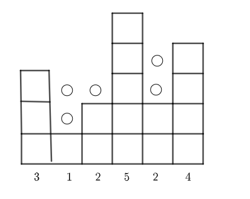

双指针解题

1. 反转字符串

   ```
   eg1:
   输入：["h","e","l","l","o"]
   输出：["o","l","l","e","h"]
   
   eg2:
   输入：["H","a","n","n","a","h"]
   输出：["h","a","n","n","a","H"]
   ```

   用两个指针, 一个开头, 一个结尾, 往中间进军

   ```javascript
   function reverseString(s) {
     let n = s.length
     for(let left = 0, right= n-1; left < right; left ++, right--) {
       [s[left], s[right]] = [s[right], s[left]]
     }
     return s
   }
   ```

   

2. 最长回文字符串

   ```
   eg1:
   输入：s = "babad"
   输出："bab"
   解释："aba" 同样是符合题意的答案。
   
   eg2:
   输入：s = "cbbd"
   输出："bb"
   
   eg3:
   输入：s = "a"
   输出："a"
   ```

   > 回文字符串的特征, 从左往右读和从右往左读是一样的

   1. 设置每个位置为中心点
   2. 通过左右指针向外扩散， 直到不满足左右指针所指向的字符不一致
   3.  循环， 求最长的

```javascript
function longestPalidrome(s) {
  let res = ''
  for(let i = 0; i<s.length; i++) {
    const s1 = palidromeStr(s, i, i)
    const s2 = palidromeStr(s, i, i+1)
    res = res.length > s1.length ? res : s1
    res = res.length > s2.lenght ? res : s2
  }
  return res
}

function palidromeStr(str, l, r) {
  while(l>0 && r < s.length && s[l] == s[r]) {
    l--;
    r++;
  }
  return str.substring(l + 1, r)
}
```

3. #### [环形链表](https://leetcode-cn.com/problems/linked-list-cycle/)

给定一个链表，判断链表中是否有环。

如果链表中有某个节点，可以通过连续跟踪 next 指针再次到达，则链表中存在环。 为了表示给定链表中的环，我们使用整数 pos 来表示链表尾连接到链表中的位置（索引从 0 开始）。 如果 pos 是 -1，则在该链表中没有环。注意：pos 不作为参数进行传递，仅仅是为了标识链表的实际情况。

如果链表中存在环，则返回 true 。 否则，返回 false 。

思路:

快慢指针

1. 快指针每次走两步, 慢指针每次走一步
2. 如果是环形, 则快指针可以追上慢指针
3. 如果不是环形, fast会先到达尾部也就是nu l l

```javascript
function hasCycle(head) {
  if(head == null || head.next == null) return false
  
  let fast = head.next.next
  let slow = head.next
  while(fast != slow) {
    if(!fast || !fast.next) return false
    fast = fast.next.next
    slow = slow.next
  }
  return true
}
```

4. #### [盛最多水的容器](https://leetcode-cn.com/problems/container-with-most-water/)

思路：

乘最多的水, 也就是面积要最大, 那么就是要最长最高

为什么双指针的做法是正确的？

双指针代表了什么？

双指针代表的是 可以作为容器边界的所有位置的范围。在一开始，双指针指向数组的左右边界，表示 数组中所有的位置都可以作为容器的边界，因为我们还没有进行过任何尝试。在这之后，我们每次将 对应的数字较小的那个指针 往 另一个指针 的方向移动一个位置，就表示我们认为 这个指针不可能再作为容器的边界了。

```javascript
function maxArea(height) {
  let left = 0
  let right = height - 1
  let ans = 0
  while(left < right) {
    let area = Math.min(height(left), height[right]) * (right - left)
    ans = Math.max(ans, area)
    
    if(height[left] < height[right]) {
      left++
    } else {
      right--
    }
  }
  return ans
}
```

4. #### [最接近的三数之和](https://leetcode-cn.com/problems/3sum-closest/)

```javascript
function threeSumClosest(nums, target) {
  	nums.sort((a, b) => a - b);
	  let res = nums[0] + nums[1] + nums[nums.length - 1];
  	 for (let i = 0; i < nums.length - 2; i++) {
      const n1 = nums[i];
      let l = i + 1;
      let r = nums.length - 1;
      while (l < r) {
        const n2 = nums[l];
        const n3 = nums[r];
        const sum = n1 + n2 + n3;
        if (sum > target) {
          r--;
        } else {
          l++;
        }
        if (Math.abs(sum - target) < Math.abs(res - target)) {
          res = sum;
        }
      }
    }
    return res;
}
```

5. #### [三数之和](https://leetcode-cn.com/problems/3sum/)

   ```javascript
   var threeSum = function(nums) {
       let ans = []
       let len = nums.length
       if(nums == null || len < 3) return ans
       nums.sort((a,b) => a-b)
       for(let i = 0; i < len; i++) {
           if(nums[i] > 0) break;
           if(i > 0 && nums[i] == nums[i-1]) continue
           let L = i + 1
           let R = len - 1
           while(L < R) {
               let sum = nums[i] + nums[L] +nums[R]
               if(sum == 0) {
                   ans.push([nums[i], nums[L], nums[R]])
                   while(L<R && nums[L] == nums[L+1]) L++
                   while(L<R && nums[R] == nums[R-1]) R--
                   L++
                   R--
               } else if(sum > 0) {
                   R--
               } else {
                   L++
               }
           }
       }
       return ans
   };
   ```

   

6. #### [旋转链表](https://leetcode-cn.com/problems/rotate-list/)

```javascript
function rotateRight(head, k) {
 	let fast = head, slow = head
  while(k--) {
    if(fast && fast.next) fast = fast.next
    else fast = head // 循环了一圈回来了
  }
  
  if(slow == fast) return head
  while(fast.next) {
    slow = slow.next
    fast = fast.next
  }
  
  fast.next = head
  head = slow.next
  slow.next = null
  return head
}
```

7. #### [最长不含重复字符的子字符串](https://leetcode-cn.com/problems/zui-chang-bu-han-zhong-fu-zi-fu-de-zi-zi-fu-chuan-lcof/)

```javascript
function lengthOfLongestSubstring(s) {
  let start = 0, end = 0
    let res = 0
    const map = new Map()
    while(end < s.length) {
        if(map.get(s[end]) >= start) {
            start = map.get(s[end]) + 1
            map.set(s[end], end)
        } else {
            map.set(s[end], end)
            res = Math.max(res, end - start + 1)
        }
        end++
    }
    return res
}
```

8. 容器盛水问题

   给定一个整形数组arr，已知其中所有的值都是非负的，将这个数组看作一个容器，请返回容器能装多少水。

   

```javascript
function maxWater(arr) {
  let left = 0, right = arr.length - 1
  let leftMax = 0, rightMax = 0
  let sum = 0
  while(left < right) {
    leftMax = Math.max(leftMax, arr[left])
    rightMax = Math.max(rightMax, arr[right])
    if(leftMax <= rightMax) {
      sum += leftMax - arr[left++]
    } else {
      sum += rightMax - arr[right--]
    }
  }
  return sum
}
```

